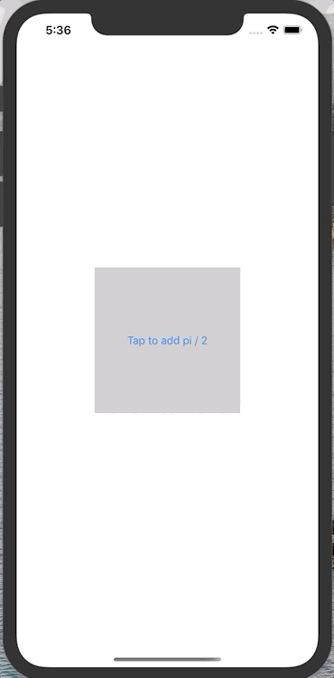

#  DidSet Animation





```swift
private var pi:CGFloat = 0 {
		didSet {
			UIView.animate(withDuration: 0.2) {
				self.thatButton.transform = CGAffineTransform(rotationAngle: self.pi)
			}
		}
	}
```
